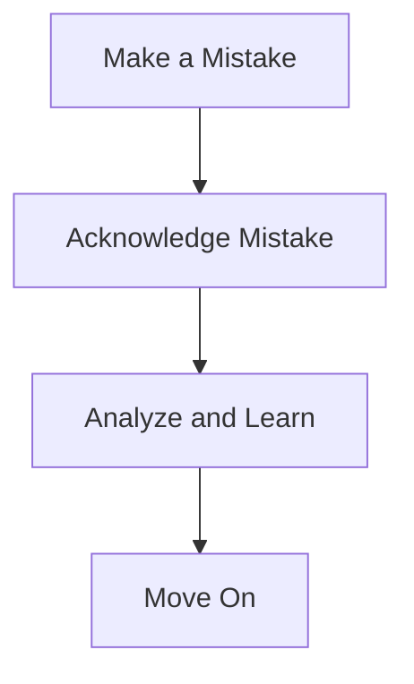

# Mental Toughness: Overcoming Adversity

Mental toughness is a cornerstone of athletic success. Whether you're a weekend warrior or a professional athlete, the ability to stay focused, handle mistakes, and maintain confidence is crucial. Let's dive into some strategies that have been proven to build mental toughness, giving you the edge to overcome adversity in any sports arena.

## Staying Focused

Staying focused can be challenging, especially under pressure. Here are some practical tips:

1. **Set Clear Goals**: Know what you want to achieve in both the short and long term.
2. **Use Visualization**: Imagine yourself successfully completing tasks or winning the game.
3. **Practice Mindfulness**: Techniques like deep breathing and meditation can help maintain focus.

### Focus Techniques Comparison

| Technique       | Description                                     | Benefits                            |
|-----------------|-------------------------------------------------|-------------------------------------|
| Goal Setting    | Clear short and long-term objectives            | Provides direction and motivation   |
| Visualization   | Mental rehearsal of performance                 | Enhances confidence and preparation |
| Mindfulness     | Meditation and deep-breathing exercises         | Reduces stress and increases focus  |

## Handling Mistakes

Mistakes are inevitable, but how you handle them can set you apart.

1. **Acknowledge Mistakes**: Recognize and accept errors without judgment.
2. **Learn from Errors**: Analyze what went wrong and how to prevent it in the future.
3. **Move On**: Don’t dwell. Learn and then let go to refocus on the task ahead.

### Mistake Handling Cycle



## Maintaining Confidence

Confidence can ebb and flow, but these strategies can help maintain it:

1. **Positive Self-talk**: Replacing negative thoughts with constructive ones.
2. **Reflect on Successes**: Regularly remind yourself of past achievements.
3. **Develop a Routine**: Consistency in preparation can build a sense of security and confidence.

### Confidence Building Tips

| Tip                   | How to Implement                              | Expected Outcome                   |
|-----------------------|-----------------------------------------------|------------------------------------|
| Positive Self-talk    | Use affirmations or mantras before competition| Boosts morale and reduces anxiety  |
| Reflect on Successes  | Keep a journal of accomplishments             | Reinforces a positive self-image   |
| Develop a Routine     | Stick to a pre-game preparation ritual        | Provides stability and confidence  |

## Real-World Application

Athletes like Serena Williams and Michael Jordan have showcased incredible mental toughness. Serena's ability to stay focused and rebound from match point after match point underscores the effectiveness of visualization and goal-setting. Similarly, Jordan’s relentless drive and ability to move past missed shots exemplify the importance of acknowledging mistakes and learning from them.

## Conclusion

Building mental toughness is an ongoing process that involves strategic focus, learning from mistakes, and maintaining confidence. Whether you're an athlete or a coach, incorporating these elements can lead to improved performance and a greater ability to overcome adversity. 

Remember, mental toughness isn’t just about pushing through the pain; it’s about smart, structured mental conditioning. Stay focused, handle your mistakes wisely, and always believe in your potential.

---

Feel free to share your thoughts and tips about building mental toughness in the comments below!
```
